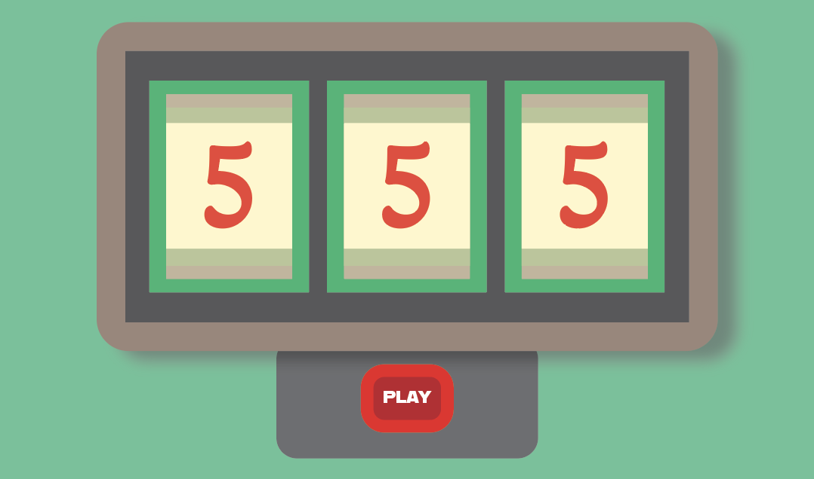

# slot machine
## Introduction

 

The first **slot machine** was called *"gambling machine"*, and it was created in Brooklyn, New York by Sittman and Pitt in 1891. It contained five drums holding a total of 50 card faces and was based on poker; it would give you poker hands every time you played. It became extremely popular.

Slot machines were also known as a **one-armed** **bandit** because of the large mechanical lever affixed to the side, which in many cases is what makes the slots spin. This machine version with the lever was how it was originally assembled.

After that many variations were created, such as the fruit machine, which is a slot machine showing fruit images. The fruit machine version is what the call it in Britain. Nowadays, with technology there are many versions.

Slot machines are the most played game in casinos - they are approximately 70% of the average U.S. casino's income.

## Description

This is a digital slot Machine - the kind you may find in Atlantic City &/or Las Vegas, without the spinning/rolling feature. It is a browser-based game that was developed to put in practice many of the concepts in class.

    Model - View - Controller

I started with the View. 

Created a basic structure with all the needed elements, and made them visible enough to be able to use them when I developed the code. For this I used HTML and CSS.

I guided myself with the user stories and wireframe I made initially.

1. Create the objects and its properties. The array with the emojis was created. 

2. State Variables/ they will keep updating

	let scores; --> this is score, and tries (as keys)
	let slotsvalue; --> this is the slots (as keys)
	let winner; --> this is a message, string variable.

The controller functions are used to update the model, state.

2. Created the render() function. Update the DOM.

3. Controller functions and Cache elements.

The following function is the most important function I have:

	function play (){
    console.log("button is working")

    //randomly generate a value for the 3 slots 
    slotsValue.slot1 = getRandomSlotValues();
    slotsValue.slot2 = getRandomSlotValues();
    slotsValue.slot3 = getRandomSlotValues();

    // Place the loosing and winning condition
    //then update the  state (scores and tries) with that value
    if (slotsValue.slot1 === slotsValue.slot2 && slotsValue.slot1 === slotsValue.slot3) {
        scores.player +=1;
        scores.tries +=1;
        scores.winner = 'Jackpot! You won the game!';
         } else if (slotsValue.slot1 === slotsValue.slot2 && slotsValue.slot1 !== slotsValue.slot3){
            scores.tries +=1;
            console.log('You lost, try again!')
            scores.winner = 'Try again!';
            } else if (slotsValue.slot1 !== slotsValue.slot2 && slotsValue.slot1 !== slotsValue.slot3){
                scores.tries +=1;
                console.log('You lost again, You can do it!')
                scores.winner = 'Next is a winner! You can do it!';
                } else if (slotsValue.slot1 !== slotsValue.slot2 && slotsValue.slot1 === slotsValue.slot3) {
                    scores.winner = '';
                    }
    
    render()
	}

But it would not work if the getRandomValues() function doesn't work.

	function getRandomSlotValues() {
 
    	const randomItem = Math.floor(Math.random()*items.length);
    	return items[randomItem]
	}

There is no trick or strategy around this game to win. This is a game of chance. 

In this specific case, the slots are only showing random values generated every-time the user presses the button "PLAY".

Every time the user get 3 slots with the same "emoji" , the user wins. 

###  "🎩", "🏡", "😑", "🦄"

In this current representation, there are 3 slots, with 4 symbols each (the 4 emojis previously shown). So the total number of possible combinations is:

	 4 x 4 x 4 = 64 combinations. 

There are 4 winning combinations out of the total 64. So the probability of winning this game is:

Number of winning combinations / Number of possible combinations = 

	= 4/64 = 0.0156.

In other words, 0.0156 are the odds of winning this game with the current set up.

---

 init
 winning/playing

## Technologies Used: 

1. HTML
2. CSS
3. JavaScript
4. IDE --> VS Code.
5. GitHub

## Getting Started: 

You can find my slot machine game [here](https://github.com/gianellin/slot_machineGame), where you may find my code, wireframes and other assets.

If you play this game, have fun! 

## Next Steps: Planned future enhancements (icebox items).

1. Add spinning feature to slots.

    1.1 It can have an activation "button" to start the spinning to work as a lever.
		Look into j.query.

2. Add audio effects to buttons and future animations.
3. The odds can be increased by considering other partial combinations.
4. Slot emojis could be swap up for higher resolution images of fruits.
5. If implemented, this game could add a payment digital feature, based out on crypto, or normal currency ($$$).

### References: 

1. [https://www.britannica.com/topic/slot-machine](https://www.britannica.com/topic/slot-machine)
2. [https://www.online-casinos.com/slots/history/](https://www.online-casinos.com/slots/history/)
3. [https://www.casinosmash.com/features/how-to-use-probability-to-win-at-slots ](https://www.casinosmash.com/features/how-to-use-probability-to-win-at-slots )
4. Sound Effect by [StudioAlivioGlobal](https://pixabay.com/sound-effects//?utm_source=link-attribution&amp;utm_medium=referral&amp;utm_campaign=music&amp;utm_content=124464)
5. [https://www.cdnfonts.com/](https://www.cdnfonts.com/)