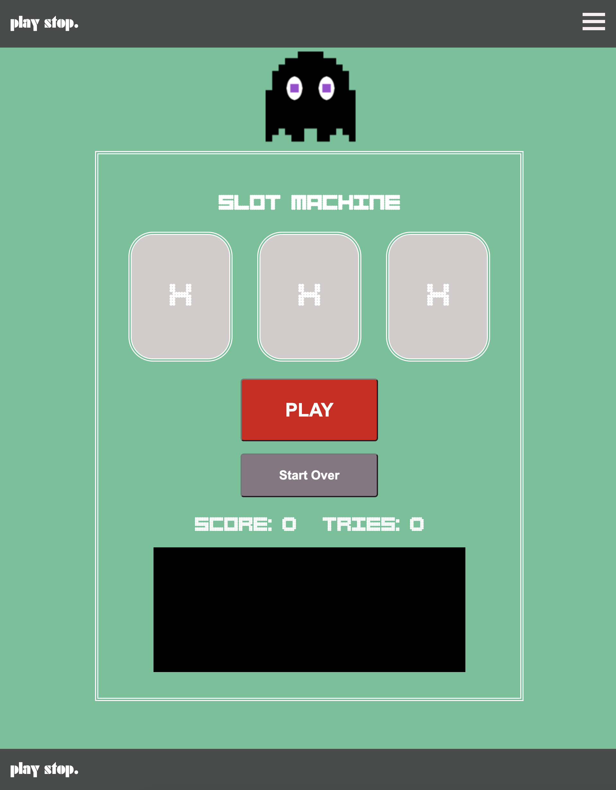

# slot machine
## Introduction

 

The first **slot machine** was called *"gambling machine"*, and it was created in Brooklyn, New York by Sittman and Pitt in 1891. It contained five drums holding a total of 50 card faces and was based on poker; it would give you poker hands every time you played. It became extremely popular.

Slot machines were also known as a **one-armed** **bandit** because of the large mechanical lever affixed to the side, which in many cases is what makes the slots spin. This machine version with the lever was how it was originally assembled.

After that many variations were created, such as the fruit machine, which is a slot machine showing fruit images. The fruit machine version is what the call it in Britain. Nowadays, with technology there are many versions.

Slot machines are the most played game in casinos - they are approximately 70% of the average U.S. casino's income.

## Description

This is a digital slot Machine - the kind you may find in Atlantic City &/or Las Vegas, without the spinning/rolling feature. It is a browser-based game that was developed to put in practice many of the concepts studied in class.

To develop this game the Model - View - Controller architecture was used.

The basic structure of the game was the first thing that was created. All the basic elements were created and properly identified with HTML and CSS. This was done based on the wireframes and user stories from the plan.

Then in JavaScript different objects were created:

1. The array with the items that are going to show in the slots.

###  "🎩", "🏡", "😑", "🦄"

2. The state variables.

3. The first function created was init() to initialize the game.

4. The second function created was render(). Created to update the DOM.

5. Then the cached elements were created as well.

6. The getRandomValues () function was created at the same time as the play() function.
   These are the funtions that will run the logic of the game, first creating the random values of the slots, and then meeting the conditions for the game.

7. After having a functional game, other functions were created to enhance the experience of the user. Such as the stop () function and the playAudio() function.

## Playing Slot Machine

The game loads in the browser showing its initial values before the player starts.

There is no trick or strategy around this game to win. This is a game of chance. 

In this specific case, the slots are only showing random values generated every-time the user presses the button "PLAY".

Every time the user get 3 slots with the same "emoji" , the user wins. 

The user can win multiple times in one run. However, the game stops - the play button is disabled, once the player has reached her/his 10th try.

## Possible combinations

In this current representation, there are 3 slots with 4 items each (the 4 emojis previously shown). Therefore the total number of possible combinations are:

	 4 x 4 x 4 = 64.

There are 4 winning combinations out of the total 64 available. So the probability of winning this game is:

Number of winning combinations / Number of possible combinations

	= 4/64 = 0.0156.

In other words, the odds of winning this game are 0.0156 with the current set up.

## Technologies Used: 

1. HTML
2. CSS
3. JavaScript
4. Editor --> VS CODE.
5. GitHub

## Playing 

You can find my slot machine game [here](https://gianellin.github.io/slot_machineGame/), where you may find my code, wireframes and other assets.

Try your luck! And find out how many times you can win a game of chance like this version of Slot Machine in 10 tries.

You can play this game from any device connected to the internet for free. It has no prize, but you can have a lot of fun!

## Next Steps: Planned future enhancements (icebox items).

1. Add spinning feature to slots.

    1.1 It can have an activation "button" to start the spinning to work as a lever.
		Look into J.query animatios.

2. Add audio effects to other buttons and message box.
3. The odds of winning this game can be increased by considering other partial combinations.
4. More slots can be added to this set up.
5. Emojis could be swap up for higher resolution images of fruits.
6. If implemented:

    6.1 Link to an account.
    6.2 Print out a real prize.
    6.2 Add payment digital feature, based out on crypto, or normal currency ($$$).

### References: 

1. [https://www.britannica.com/topic/slot-machine](https://www.britannica.com/topic/slot-machine)
2. [https://www.online-casinos.com/slots/history/](https://www.online-casinos.com/slots/history/)
3. [https://www.casinosmash.com/features/how-to-use-probability-to-win-at-slots ](https://www.casinosmash.com/features/how-to-use-probability-to-win-at-slots) 
4. Sound Effect by [StudioAlivioGlobal](https://pixabay.com/sound-effects//?utm_source=link-attribution&amp;utm_medium=referral&amp;utm_campaign=music&amp;utm_content=124464)
5. [https://www.cdnfonts.com/](https://www.cdnfonts.com/)
6. [Slot Machine](https://gianellin.github.io/slot_machineGame/) 